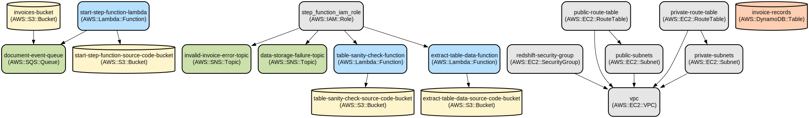

# Automated Invoice Processing Pipeline with AWS Services

This project implements a serverless invoice processing pipeline that extracts and validates table data from PDF invoices using AWS services. It automatically processes uploaded invoices, performs data validation, and handles errors through a robust notification system.

The solution leverages AWS Step Functions to orchestrate the processing workflow, AWS Textract for intelligent document processing, and various AWS services (Lambda, S3, SQS, SNS) to create a scalable and reliable system. The infrastructure is defined as code using Terraform, enabling consistent and repeatable deployments.

## Repository Structure
```
.
├── src/                               # Lambda function source code
│   ├── extract_table_data.py         # Extracts table data from PDFs using AWS Textract
│   ├── start_step_function.py        # Initiates Step Function workflow for new documents
│   └── table_sanity_check.py         # Validates extracted table data structure
└── terraform/                         # Infrastructure as Code
    ├── main.tf                       # Main Terraform configuration
    ├── modules/                      # Reusable Terraform modules
    │   ├── dynamodb/                 # DynamoDB table for invoice records
    │   ├── eventbridge/              # EventBridge rules configuration
    │   ├── iam/                      # IAM roles and policies
    │   ├── lambda/                   # Lambda function infrastructure
    │   ├── redshift/                 # Redshift cluster configuration
    │   ├── s3/                       # S3 buckets for storage
    │   ├── sns/                      # SNS topics for notifications
    │   ├── sqs/                      # SQS queues for event handling
    │   ├── step-function/            # Step Functions workflow
    │   └── vpc/                      # VPC and networking components
    ├── outputs.tf                    # Terraform outputs
    ├── provider.tf                   # AWS provider configuration
    └── variables.tf                  # Terraform variables
```

## Usage Instructions
### Prerequisites
- AWS Account with appropriate permissions
- AWS CLI installed and configured
- Terraform >= 1.0.0
- Python >= 3.8
- boto3 library for Python

### Installation

1. Clone the repository:
```bash
git clone <repository-url>
cd <repository-name>
```

2. Install Python dependencies:
```bash
pip install boto3
```

3. Initialize Terraform:
```bash
cd terraform
terraform init
```

4. Configure AWS credentials:
```bash
aws configure
```

5. Deploy the infrastructure:
```bash
terraform plan
terraform apply
```

### Quick Start
1. Upload a PDF invoice to the created S3 bucket:
```bash
aws s3 cp invoice.pdf s3://invoices-<random-id>/
```

2. The system will automatically:
- Trigger the processing pipeline via SQS
- Extract table data using AWS Textract
- Perform sanity checks on the extracted data
- Store results in DynamoDB
- Send notifications for any errors

### More Detailed Examples

Processing an invoice with tables:
```python
import boto3

s3 = boto3.client('s3')

# Upload invoice to S3
s3.upload_file(
    'invoice.pdf',
    'invoices-<random-id>',
    'invoices/invoice.pdf'
)
```

### Troubleshooting

Common issues and solutions:

1. S3 Upload Failures
- Error: "Access Denied"
- Solution: Check IAM permissions and bucket policies
- Command to verify permissions:
```bash
aws s3api get-bucket-policy --bucket invoices-<random-id>
```

2. Lambda Function Errors
- Check CloudWatch logs:
```bash
aws logs get-log-events --log-group-name /aws/lambda/extract_table_data
```

3. Step Function Execution Failures
- View execution history in AWS Console
- Check SNS topic subscriptions for error notifications

## Data Flow
The system processes invoices through a series of steps, from upload to data extraction and validation.

```ascii
Upload PDF → S3 Bucket → SQS Queue → Step Function
     ↓
Lambda Functions (Extract/Validate)
     ↓
DynamoDB ← Success | Error → SNS Notifications
```

Component interactions:
1. S3 triggers SQS event on new invoice upload
2. SQS invokes Lambda to start Step Function
3. Step Function orchestrates data extraction and validation
4. AWS Textract processes PDF documents
5. DynamoDB stores processed invoice data
6. SNS handles error notifications
7. VPC components secure Redshift access

## Infrastructure



### Lambda Functions
- `extract_table_data`: Processes PDFs using AWS Textract
- `table_sanity_check`: Validates extracted table data
- `start_step_function`: Initiates processing workflow

### Storage
- S3 Buckets:
  - `invoices-<random-id>`: Stores invoice PDFs
  - Lambda function code buckets for each function
- DynamoDB Table: `invoice-records` for storing processed data

### Messaging
- SQS Queue: `document-event-queue` with DLQ
- SNS Topics:
  - `invalid-invoice-error-topic`
  - `data-storage-failure-topic`

### Networking
- VPC with CIDR `10.0.0.0/16`
- Public and private subnets across availability zones
- Security groups for Redshift access
- Route tables for subnet traffic management